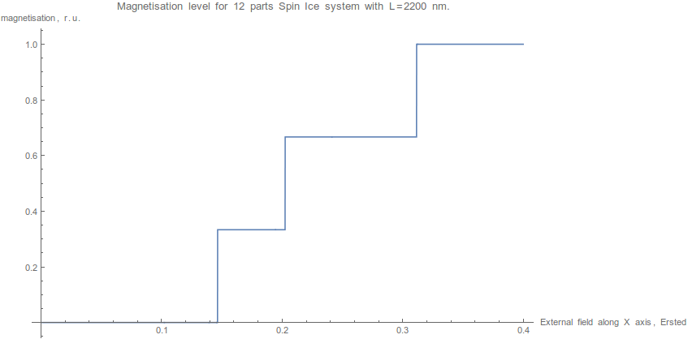

# spinIceStatSumm2
Вычисление статсуммы с учетом внешнего поля

Эксперимент аналогичен SpinIceStatSumm, за исключением того,
что в файл сохраняются энергии всех конфигураций, и дополнительно сохраняется вектор намагничености.

## Расчет намагниченности системы
В файле *magnetisation.nb* производится точный расчет уровня намагничености системы 12 частиц.

Намагниченность горизонтально направленных частиц при приложении вертикального поля остается нулевой,
так как при приложении перпендикулярного поля энергия остается нулевой. График не приводится.
